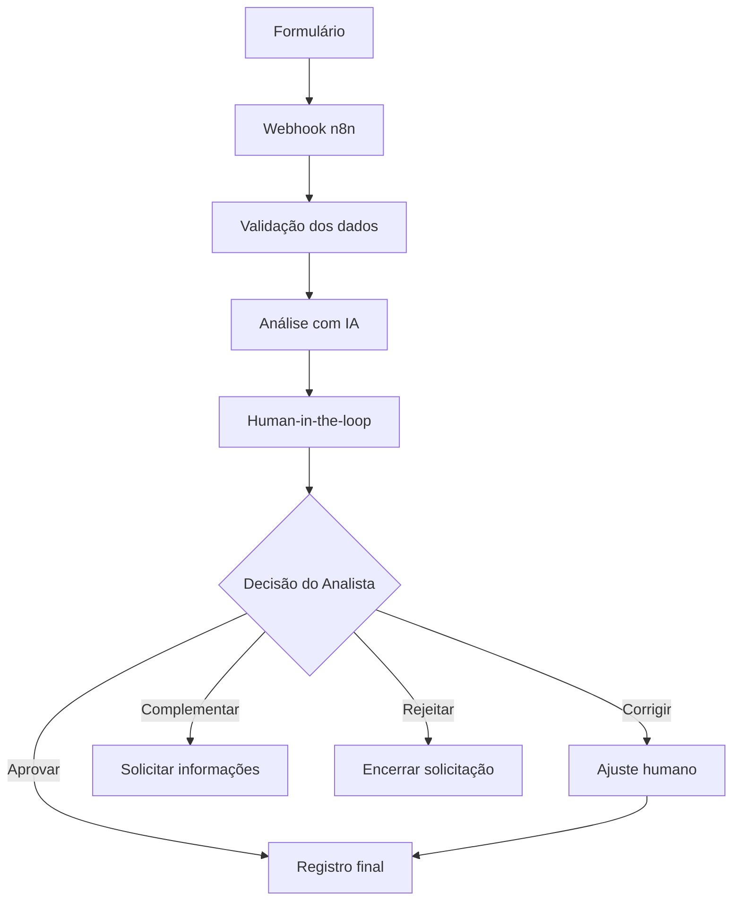

# 🤖 IA Aplicada à Análise de Requisitos e Automação com n8n

> Projeto desenvolvido para o desafio da DIO **“Treinando uma IA de Aprendizagem: Explore o Poder do NotebookLM”**.

## 📌 Sobre o projeto

Este projeto utiliza o **NotebookLM** como ambiente de aprendizagem baseada em fontes para estudar como **Inteligência Artificial Generativa** e **automação com n8n** podem apoiar atividades de **Análise de Requisitos**.

O foco não foi apenas obter respostas da IA, mas testar a qualidade das fontes, comparar prompts simples e estruturados, registrar falhas, refinar instruções e manter a **validação humana** como etapa obrigatória do processo.

## 🎯 Objetivo

Responder à pergunta:

> **Como a IA generativa, combinada com boas práticas de Engenharia de Requisitos e automação com n8n, pode aumentar a produtividade de um Analista de Requisitos sem reduzir a qualidade, a rastreabilidade e a validação humana?**

## 📚 Fontes principais utilizadas

A curadoria priorizou materiais oficiais e documentação técnica.

1. **IREB / CPRE — Glossary of Requirements Engineering (PT-BR)**  
   Base para conceitos como requisito, stakeholder, elicitação e rastreabilidade.
2. **IREB — AI4RE Syllabus and Study Guide**  
   Base para aplicação de IA em Engenharia de Requisitos, limites dos LLMs e necessidade de supervisão humana.
3. **Atlassian — Histórias de Usuário**  
   Base para estrutura `Como / Quero / Para`, 3 Cs e critérios de aceite.
4. **Google Cloud — Estratégias de Design de Prompts**  
   Base para construção, restrição e refinamento de prompts.
5. **n8n Docs — Webhook e Human-in-the-loop**  
   Base para automação, gatilhos, workflows e revisão humana em etapas críticas.

### Fontes complementares

- IBM — Business Rules Management
- CPRE Foundation Level Handbook
- Documentação geral do n8n

## 🧠 Principais conceitos estudados

- Requisito
- Elicitação
- Stakeholder
- Rastreabilidade
- História de Usuário
- Critério de Aceite
- Regra de Negócio
- Prompt
- LLM
- IA Generativa
- Workflow
- API
- Webhook
- n8n
- Human-in-the-loop

## 🧪 Engenharia de Prompts

### Prompt inicial

```text
Crie requisitos para um sistema de agendamento.
```

O prompt é genérico e permite que a IA faça suposições não confirmadas.

### Prompt refinado

```text
Atue como Analista de Requisitos.

Antes de criar qualquer requisito:

1. identifique informações ausentes;
2. identifique stakeholders;
3. liste perguntas de esclarecimento;
4. separe fatos de suposições;
5. não invente regras de negócio;
6. marque informações não confirmadas como "Necessita validação".

Somente depois apresente requisitos preliminares.
```

### Aprendizado

A qualidade da resposta melhora quando o prompt define:

- papel;
- objetivo;
- contexto;
- restrições;
- formato de saída;
- tratamento explícito da incerteza.

## 🩹 Cicatrizes do projeto

### 1. Fontes insuficientes

Na primeira versão do glossário, o NotebookLM informou que não havia cobertura suficiente para conceitos importantes como requisito, rastreabilidade, regra de negócio, webhook e human-in-the-loop.

**Ação:** a curadoria foi revisada com materiais mais específicos do **IREB**, **IBM** e **n8n**.

**Resultado:** os conceitos passaram a ter cobertura documental adequada.

### 2. Cadeias de suposições

Em um teste adversarial, a entrada foi:

```text
Quero que o aplicativo permita cancelar qualquer agendamento facilmente.
Acho que seria bom cobrar uma taxa quando a pessoa cancelar muito perto do horário.
```

A IA inicialmente começou a perguntar detalhes como valor, percentual e forma de cobrança da taxa.

**Problema:** a frase **“acho que seria bom”** é uma sugestão, e não uma regra de negócio confirmada.

**Refinamento:** o System Prompt foi ajustado para:

- diferenciar fato, sugestão e regra;
- impedir cadeias de suposições;
- validar primeiro a existência da regra;
- não gerar detalhes dependentes de uma regra ainda não confirmada;
- não criar cenários de exceção sem evidência;
- manter `NECESSITA_REVISAO_HUMANA` como status obrigatório.

## ✅ Resultado do teste final

```json
{
  "necessidade": "Permitir o cancelamento de agendamentos pelo aplicativo",
  "persona": "Usuário do aplicativo",
  "objetivo": "Permitir o cancelamento de agendamentos pelo aplicativo",
  "beneficio_esperado": "Necessita validação",
  "regras_negocio": [],
  "ambiguidades": [
    "facilmente",
    "muito perto do horário",
    "qualquer agendamento"
  ],
  "informacoes_ausentes": [
    "Confirmação se a cobrança de taxa será adotada como regra de negócio",
    "Definição das condições de antecedência para cancelamento"
  ],
  "perguntas_stakeholders": [
    "A cobrança de taxa será realmente adotada como regra de negócio?",
    "Quais tipos de agendamento poderão ser cancelados pelo aplicativo?"
  ],
  "cenarios_excecao": [],
  "status": "NECESSITA_REVISAO_HUMANA"
}
```

A IA não transforma a sugestão de taxa em regra confirmada. A decisão continua com o Analista de Requisitos.

## ⚙️ Arquitetura conceitual com n8n



### Papel da IA

- organizar informações;
- identificar ambiguidades;
- localizar lacunas;
- gerar perguntas;
- estruturar um rascunho.

### Papel do Analista

- interpretar;
- validar;
- corrigir;
- esclarecer;
- decidir.

> **A IA organiza e sugere. O Analista interpreta, valida e decide.**

## 🛡️ Human-in-the-loop

O projeto utiliza o conceito de **Human-in-the-loop (HITL)** para manter decisões críticas sob revisão humana.

No fluxo proposto, a IA nunca deve aprovar requisitos automaticamente.

```text
NECESSITA_REVISAO_HUMANA
```

## ⚠️ Riscos e controles

| Risco | Controle |
|---|---|
| IA inventar regras | Restrições explícitas no prompt |
| Falta de contexto | Uso de fontes e contexto de negócio |
| Ambiguidades | Identificação de termos vagos |
| Cadeia de suposições | Perguntas em camadas |
| Automação excessiva | Human-in-the-loop |
| Informação ausente | Marcador `Necessita validação` |
| Perda de rastreabilidade | Registro estruturado e revisão humana |

## 📖 Glossário resumido

**Requisito** — necessidade, condição ou capacidade que deve ser atendida.  
**Elicitação** — processo de descobrir, levantar e esclarecer requisitos junto aos stakeholders e outras fontes.  
**Stakeholder** — pessoa ou organização que influencia ou é afetada pelo sistema.  
**Rastreabilidade** — capacidade de relacionar a origem, evolução, implementação e validação de um requisito.  
**História de Usuário** — descrição de uma necessidade sob a perspectiva do usuário.  
**Critério de Aceite** — condição clara e verificável para uma história ou requisito ser aceito.  
**Regra de Negócio** — lógica ou restrição que orienta o comportamento do negócio.  
**Prompt** — instrução enviada a um modelo de IA.  
**LLM** — modelo de linguagem de grande escala.  
**Workflow** — sequência organizada de etapas de um processo.  
**Webhook** — mecanismo usado para receber dados automaticamente quando um evento ocorre.  
**Human-in-the-loop** — abordagem em que uma pessoa participa da revisão ou decisão em um processo apoiado por IA.

## ♻️ 5 prompts reutilizáveis

### 1. História de Usuário + Critérios de Aceite

```text
Atue como Analista de Requisitos.

Extraia a História de Usuário e os Critérios de Aceite claros,
objetivos e verificáveis deste texto.

Não invente persona, benefício ou regra.

Quando faltar informação, escreva:
"Necessita validação".
```

### 2. Identificação de ambiguidades

```text
Liste exclusivamente os termos subjetivos e ambíguos presentes no requisito.

Não tente interpretá-los.
Não confunda informação ausente com ambiguidade.
```

### 3. Perguntas de elicitação em camadas

```text
Identifique sugestões e hipóteses presentes na solicitação.

Gere primeiro perguntas de Nível 1 para confirmar se a regra de negócio
realmente deve existir.

Não detalhe valores, percentuais ou implementação antes da confirmação.
```

### 4. Fatos x sugestões x lacunas

```text
Classifique o texto em:

1. Fatos confirmados
2. Sugestões ou hipóteses
3. Informações ausentes

Para informações ausentes utilize:
"Necessita validação".

Não transforme sugestões em regras.
```

### 5. Clareza e testabilidade

```text
Revise o requisito para torná-lo claro, objetivo e testável.

Preserve o significado original.
Não invente regras ou detalhes técnicos.

Quando faltar informação, marque:
"Necessita validação".

Indique que o resultado necessita revisão humana.
```

## 📘 Miniguia de estudo

O estudo completo foi consolidado em um Miniguia contendo:

1. Introdução
2. Fundamentos de Engenharia de Requisitos
3. Histórias de Usuário e Critérios de Aceite
4. IA aplicada à Análise de Requisitos
5. Engenharia de Prompts
6. Cicatrizes do Projeto
7. Automação com n8n
8. Human-in-the-loop
9. Estudo de Caso
10. Riscos e Controles
11. Glossário
12. Prompts Reutilizáveis
13. Principais Aprendizados
14. Conclusão

## 🎓 Principais aprendizados

- Boas fontes são tão importantes quanto bons prompts.
- Hipóteses não devem ser tratadas como regras confirmadas.
- IA pode acelerar a análise, mas não substitui julgamento humano.
- Prompts precisam ser testados e refinados.
- Human-in-the-loop reduz riscos em decisões críticas.
- Automação deve preservar rastreabilidade e governança.
- “Necessita validação” é preferível a inventar informação.

## 🏁 Conclusão

A aplicação responsável de IA à Engenharia de Requisitos não significa automatizar decisões humanas.

A abordagem proposta combina:

**Fontes confiáveis + Prompts estruturados + Automação n8n + Rastreabilidade + Análise crítica + Validação humana**

O resultado é um processo em que a IA aumenta a produtividade sem retirar do Analista de Requisitos a responsabilidade pela interpretação e validação das necessidades do negócio.

## 🛠️ Tecnologias e ferramentas

- NotebookLM
- Inteligência Artificial Generativa
- IREB / CPRE
- Engenharia de Prompts
- n8n
- Git
- GitHub
- Markdown

## 👩‍💻 Autora

**Kelen Cristina Silva**

Projeto de estudo e portfólio voltado à aplicação de Inteligência Artificial em Análise de Requisitos e Automação de Processos.

